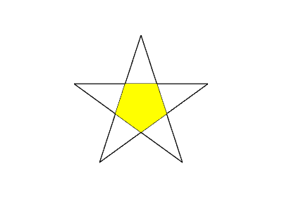

# homework1

## 01 内容要求

> 熟悉并创建绘图区域或窗口
>
> 以线框绘制一个平面五角星形状
>
> 填充五角星中间的五边形

## 02 实现方法

### 1. 顶点着色器

```html
<script id="vertex-shader-2d" type="notjs">

    // 一个属性变量，将会从缓冲中获取数据
    //attribute vec4 a_position;
    attribute vec2 a_position;

    uniform vec2 u_resolution;
   
    // 所有着色器都有一个main方法
    void main() {
      // 从像素坐标转换到 0.0 到 1.0
      vec2 zeroToOne = a_position / u_resolution;
   
      // 再把 0->1 转换 0->2
      vec2 zeroToTwo = zeroToOne * 2.0;
   
      // 把 0->2 转换到 -1->+1 (裁剪空间)
      vec2 clipSpace = zeroToTwo - 1.0;

      // gl_Position 是一个顶点着色器主要设置的变量
      //gl_Position = a_position;
      gl_Position = vec4(clipSpace, 0, 1);
    }
  
</script>
```

设置一个可以将像素坐标对应到裁剪空间的顶点着色器。

### 2. 片断着色器

```html
<script id="fragment-shader-2d" type="notjs">
   
    // 片断着色器没有默认精度，所以我们需要设置一个精度
    // mediump是一个不错的默认值，代表“medium precision”（中等精度）
    precision mediump float;

    uniform vec4 u_color;
   
    void main() {
      // gl_FragColor是一个片断着色器主要设置的变量
      gl_FragColor = u_color;
    }
   
</script>
```

设置一个可以改变颜色的片断着色器。

### 3. 五角星

假设五角星外接圆半径为1，有一个角朝上，以五角星中心为原点。

五角星的五个角顶点坐标分别为（按顺时针）：

$A(0,1)$

$B(\cos18^{\circ},\sin18^{\circ})$

$C(\cos54^{\circ},-\sin54^{\circ})$

$D(-\cos54^{\circ},-\sin54^{\circ})$

$E(-\cos18^{\circ},\sin18^{\circ})$

假设$t$为内部五边形外接圆半径，

$t=\frac{1+\tan^218^{\circ}}{3-\tan^218^{\circ}}$，

则五个顶点对应的坐标为：

$AA(0, -t)$

$BB(-t*\cos18^{\circ},-t*\sin18^{\circ})$

$CC(-t*\cos54^{\circ},t*\sin54^{\circ})$

$DD(t*\cos54^{\circ},t*\sin54^{\circ})$

$EE(t*\cos18^{\circ},-t*\sin18^{\circ})$.

用$200 + 100 * x, 150 + 100 * y$作为五角星10个点的像素坐标。

### 4. 绘制

用LINE_LOOP连接A、C、E、B、D，得到五角星，用TRIANGLE_FAN连接AA、BB、CC、DD、EE，得到五边形填充。

## 03 效果展示

[main.html]: ./main.html


