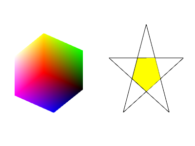

# homework2

## 01 内容要求

> 绘制一个三维彩色立方体
>
> 让立方体自动旋转
>
> 可以参考教材上的代码
>
> 把上节课绘制的五角星旋转立起来

## 02 实现方法

### 1. 三维矩阵

```javascript
var m4 = {
    translation: function (tx, ty, tz) {
        return [
            1, 0, 0, 0,
            0, 1, 0, 0,
            0, 0, 1, 0,
            tx, ty, tz, 1,
        ];
    },

    xRotation: function (angleInRadians) {
        var c = Math.cos(angleInRadians);
        var s = Math.sin(angleInRadians);

        return [
            1, 0, 0, 0,
            0, c, s, 0,
            0, -s, c, 0,
            0, 0, 0, 1,
        ];
    },

    yRotation: function (angleInRadians) {
        var c = Math.cos(angleInRadians);
        var s = Math.sin(angleInRadians);

        return [
            c, 0, -s, 0,
            0, 1, 0, 0,
            s, 0, c, 0,
            0, 0, 0, 1,
        ];
    },

    zRotation: function (angleInRadians) {
        var c = Math.cos(angleInRadians);
        var s = Math.sin(angleInRadians);

        return [
            c, s, 0, 0,
            -s, c, 0, 0,
            0, 0, 1, 0,
            0, 0, 0, 1,
        ];
    },

    scaling: function (sx, sy, sz) {
        return [
            sx, 0, 0, 0,
            0, sy, 0, 0,
            0, 0, sz, 0,
            0, 0, 0, 1,
        ];
    },

    translate: function (m, tx, ty, tz) {
        return m4.multiply(m, m4.translation(tx, ty, tz));
    },

    xRotate: function (m, angleInRadians) {
        return m4.multiply(m, m4.xRotation(angleInRadians));
    },

    yRotate: function (m, angleInRadians) {
        return m4.multiply(m, m4.yRotation(angleInRadians));
    },

    zRotate: function (m, angleInRadians) {
        return m4.multiply(m, m4.zRotation(angleInRadians));
    },

    scale: function (m, sx, sy, sz) {
        return m4.multiply(m, m4.scaling(sx, sy, sz));
    },

    orthographic: function (left, right, bottom, top, near, far) {
        return [
            2 / (right - left), 0, 0, 0,
            0, 2 / (top - bottom), 0, 0,
            0, 0, 2 / (near - far), 0,

            (left + right) / (left - right),
            (bottom + top) / (bottom - top),
            (near + far) / (near - far),
            1,
        ];
    },

    multiply: function (a, b) {
        var a00 = a[0 * 4 + 0];
        var a01 = a[0 * 4 + 1];
        var a02 = a[0 * 4 + 2];
        var a03 = a[0 * 4 + 3];
        var a10 = a[1 * 4 + 0];
        var a11 = a[1 * 4 + 1];
        var a12 = a[1 * 4 + 2];
        var a13 = a[1 * 4 + 3];
        var a20 = a[2 * 4 + 0];
        var a21 = a[2 * 4 + 1];
        var a22 = a[2 * 4 + 2];
        var a23 = a[2 * 4 + 3];
        var a30 = a[3 * 4 + 0];
        var a31 = a[3 * 4 + 1];
        var a32 = a[3 * 4 + 2];
        var a33 = a[3 * 4 + 3];
        var b00 = b[0 * 4 + 0];
        var b01 = b[0 * 4 + 1];
        var b02 = b[0 * 4 + 2];
        var b03 = b[0 * 4 + 3];
        var b10 = b[1 * 4 + 0];
        var b11 = b[1 * 4 + 1];
        var b12 = b[1 * 4 + 2];
        var b13 = b[1 * 4 + 3];
        var b20 = b[2 * 4 + 0];
        var b21 = b[2 * 4 + 1];
        var b22 = b[2 * 4 + 2];
        var b23 = b[2 * 4 + 3];
        var b30 = b[3 * 4 + 0];
        var b31 = b[3 * 4 + 1];
        var b32 = b[3 * 4 + 2];
        var b33 = b[3 * 4 + 3];
        return [
            b00 * a00 + b01 * a10 + b02 * a20 + b03 * a30,
            b00 * a01 + b01 * a11 + b02 * a21 + b03 * a31,
            b00 * a02 + b01 * a12 + b02 * a22 + b03 * a32,
            b00 * a03 + b01 * a13 + b02 * a23 + b03 * a33,
            b10 * a00 + b11 * a10 + b12 * a20 + b13 * a30,
            b10 * a01 + b11 * a11 + b12 * a21 + b13 * a31,
            b10 * a02 + b11 * a12 + b12 * a22 + b13 * a32,
            b10 * a03 + b11 * a13 + b12 * a23 + b13 * a33,
            b20 * a00 + b21 * a10 + b22 * a20 + b23 * a30,
            b20 * a01 + b21 * a11 + b22 * a21 + b23 * a31,
            b20 * a02 + b21 * a12 + b22 * a22 + b23 * a32,
            b20 * a03 + b21 * a13 + b22 * a23 + b23 * a33,
            b30 * a00 + b31 * a10 + b32 * a20 + b33 * a30,
            b30 * a01 + b31 * a11 + b32 * a21 + b33 * a31,
            b30 * a02 + b31 * a12 + b32 * a22 + b33 * a32,
            b30 * a03 + b31 * a13 + b32 * a23 + b33 * a33,
        ];
    },
};
```

通过三维矩阵，将平移、旋转、缩放和像素坐标转换整合起来。

### 2. 图形绘制

#### 1）立方体

在三维空间，设置立方体顶点与颜色。通过在片断着色器中设置可变量，实现进行插值后整个立方体呈渐变效果。

#### 2）五角星

在homework1的基础上，将五角星线框及内部五边形各个顶点的z值设为0，将二维五角星拓展至三维。

### 3. 旋转

通过三维矩阵，使立方体绕x轴、y轴旋转，五角星绕y轴旋转。

通过`requestAnimationFrame`，采用系统时间间隔，展示旋转效果。

## 03 效果展示

[main.html]: ./main.html
[github]: https://kiainio.github.io/WebGL/homework2/main.html

