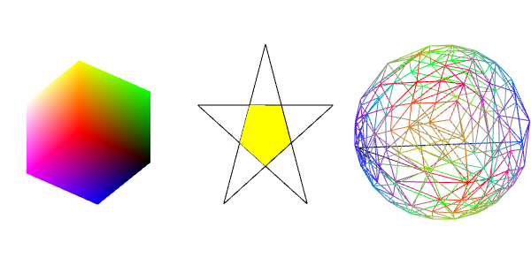
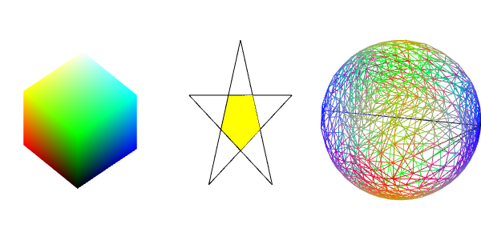
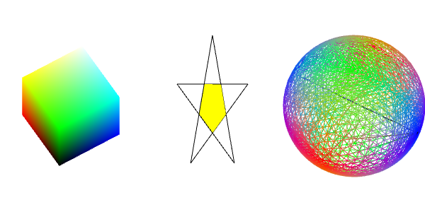
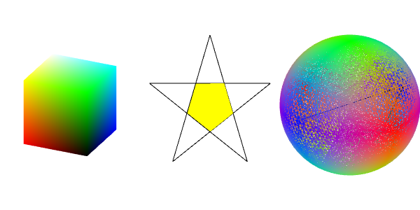
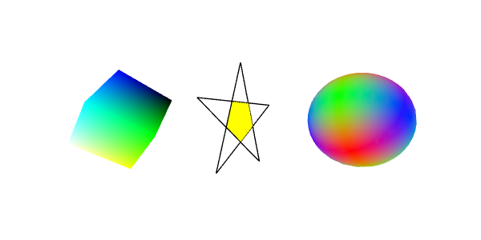

# homework3

## 01 内容要求

> 利用递归细分绘制一个三维球面（参考教材）
>
> 将五角星、立方体和球体的中心沿某条线排列
>
> 三个对象都放置到视景体中可见
>
> 投影方式设置为透视投影
>
> 开启光照，体会不同光照和材质设置带来的效果变化
>
> 至少绘制出一个物体的阴影效果

## 02 实现方法

### 1. 三维球面

```javascript
var va = [0, 0, -1];
var vb = [0, 0.942809, 0.333333];
var vc = [-0.816497, -0.471405, 0.333333];
var vd = [0.816497, -0.471405, 0.333333];

tetrahedron(va, vb, vc, vd, 4);

function tetrahedron(a, b, c, d, n) {
    devideTriangle(a, b, c, n);
    devideTriangle(d, c, b, n);
    devideTriangle(a, d, b, n);
    devideTriangle(a, c, d, n);
}

function devideTriangle(a, b, c, count) {
    if (count > 0) {
        var ab = normalize(mix(a, b, 0.5));
        var ac = normalize(mix(a, c, 0.5));
        var bc = normalize(mix(b, c, 0.5));

        devideTriangle(a, ab, ac, count - 1);
        devideTriangle(ab, b, bc, count - 1);
        devideTriangle(bc, c, ac, count - 1);
        devideTriangle(ab, bc, ac, count - 1);
    }
    else {
        spherePointsArray = spherePointsArray.concat(a);
        spherePointsArray = spherePointsArray.concat(b);
        spherePointsArray = spherePointsArray.concat(c);
        sphereColorsArray.push(Math.sqrt(a[0] * a[0]) * 256, Math.sqrt(a[1] * a[1]) * 256, Math.sqrt(a[2] * a[2]) * 256);
        sphereColorsArray.push(Math.sqrt(b[0] * b[0]) * 256, Math.sqrt(b[1] * b[1]) * 256, Math.sqrt(b[2] * b[2]) * 256);
        sphereColorsArray.push(Math.sqrt(c[0] * c[0]) * 256, Math.sqrt(c[1] * c[1]) * 256, Math.sqrt(c[2] * c[2]) * 256);
        index += 3;
    }
}
```

参考教材，采用递归细分法。将正四面体各棱中点相连，归一化。达到目标细分层数后，将顶点存入数组。

相比于球面，线框效果较明显，展示时使用线框绘制结果。根据细分程度不同，有：









当细分度为6时，顶点数达49152，有较明显的计算时间。

### 2. 透视投影

```javascript
perspective: function(fieldOfViewInRadians, aspect, near, far) {
    var f = Math.tan(Math.PI * 0.5 - 0.5 * fieldOfViewInRadians);
    var rangeInv = 1.0 / (near - far);

    return [
    f / aspect, 0, 0, 0,
    0, f, 0, 0,
    0, 0, (near + far) * rangeInv, -1,
    0, 0, near * far * rangeInv * 2, 0
    ];
}
```

设定视锥，通过矩阵将视锥中的空间转换到裁剪空间中， `zNear` 决定了被正面切割的位置，`zFar` 决定被背面切割的位置。

将物体放到视图范围内，对立方体、五角星和球体进行适当平移。



可明显观察到“近大远小”的透视效果。

### 3. 光照


## 03 效果展示

[方向光源]: ./lighting-directional.html
[github]: https://kiainio.github.io/WebGL/homework3/lighting-directional.html


