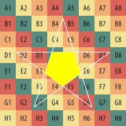
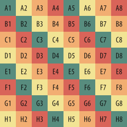
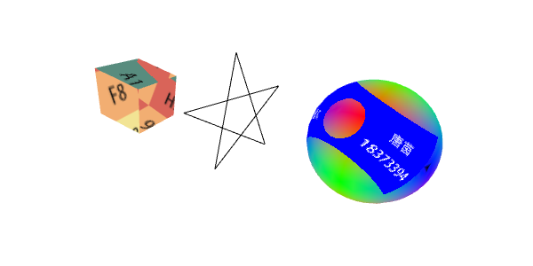

# homework4

## 01 内容要求

> 将五角星、立方体和球体的中心沿某条线排列
>
> 将学号和姓名制作成一张贴图图片
>
> 将该图片作为纹理映射到某个物体上
>
> 立方体上设置环境贴图，反射出五角星的形状

## 02 实现方法

### 1. 纹理映射

使用透视投影的方式将贴图投影到球体上。

加载纹理，在片断着色器中判断纹理坐标，在范围内的使用贴图纹理，在范围外的使用原有颜色。

### 2. 环境贴图

使用256*256立方体贴图

- positive_x：

  

- 其余五面

  

通过GLSL的内置函数`reflect`计算反射。

## 03 效果展示

[本地](./main.html)（需通过服务器打开，可参考[作业说明](../readme.md/##01-作业说明)

[github](https://kiainio.github.io/WebGL/homework4/main.html)

